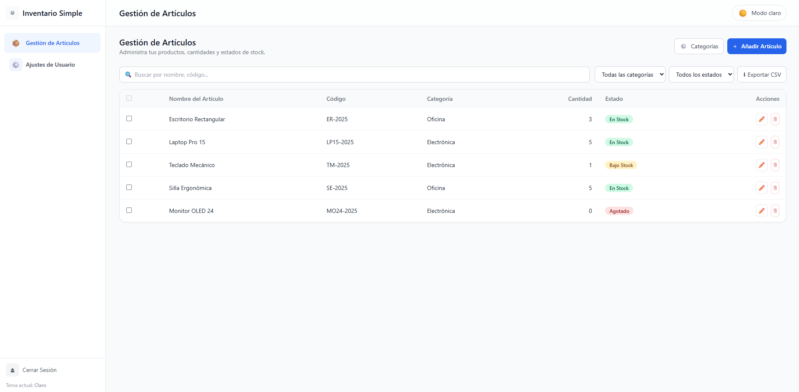

# 📦 Inventario Simple  
**Full Stack – React + Vite + Node.js + Express + SQLite**

Aplicación web de inventario desarrollada como proyecto personal full stack.

---

## 🚀 Demo en vivo
👉 https://inventario-simple-app.vercel.app

---

## 🖼️ Vista previa de la aplicación



_Vista general del flujo principal y la gestión del inventario._

---

## 📁 Estructura del proyecto

- **client/** → Frontend en React + Vite + Tailwind CSS  
- **server/** → Backend en Node.js + Express + SQLite  

---

## ⚙️ Instrucciones rápidas de uso

### 1️⃣ Backend
```bash
cd server
cp .env.example .env
# (Opcional) editar .env si deseas cambiar el puerto o la ruta de la base de datos
npm install
npm run dev
```

El backend se levantará por defecto en:
👉 http://localhost:4000

### 2️⃣ Frontend
```bash
cd client
npm install
npm run dev
```

El frontend se levantará por defecto en:
👉 http://localhost:5173

📌 Asegúrate de que ambos (client y server) estén corriendo al mismo tiempo.

---

## ✨ Características
- Autenticación con registro e inicio de sesión
- Gestión de artículos con CRUD completo
- Gestión de categorías mediante modal
- Exportación de artículos a CSV
- Ajustes de usuario (nombre, correo, contraseña)
- Layout responsivo con sidebar colapsable en móviles
- Soporte de modo claro/oscuro con toggle global
- Notificaciones tipo toast para feedback al usuario

---

## 🧠 Notas finales
Este código está pensado para ser comprensible y modificable por un desarrollador Junior.
Incluye comentarios en las secciones principales para guiar la lectura y facilitar el mantenimiento.
